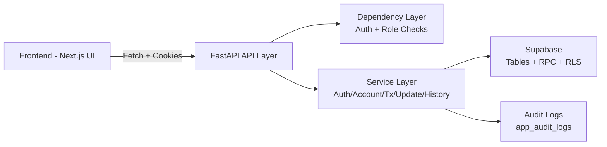
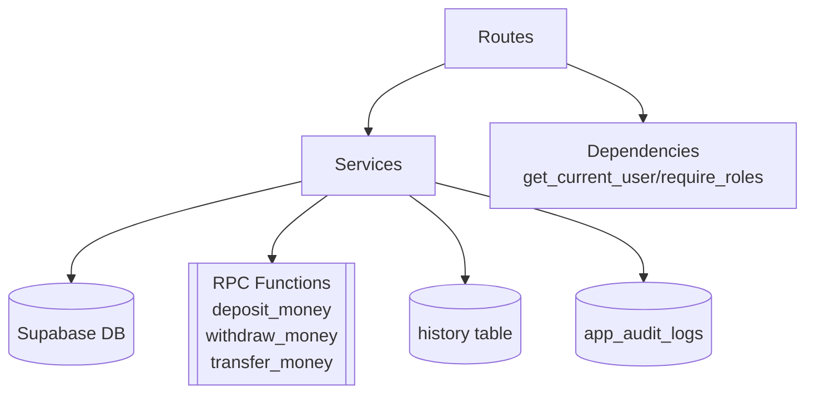
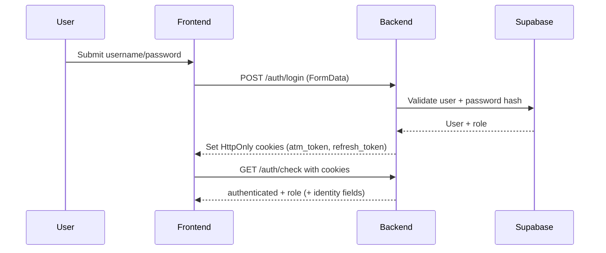
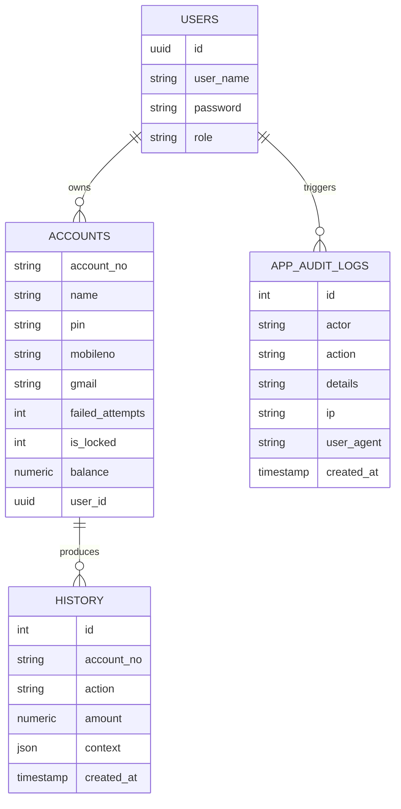

# RupeeWave Project Study Report

## 1. Introduction
RupeeWave is a full-stack ATM banking simulation built with a FastAPI backend and a Next.js frontend. The backend is responsible for authentication, account operations, transactions, profile updates, history, and auditing, while the frontend provides a role-aware dashboard UI for admin/teller workflows.

The current implementation emphasizes:
- cookie-based authentication (access + refresh tokens),
- role-based authorization,
- Supabase-backed persistence,
- transaction/history/audit flows,
- modern UI components for banking operations.

---

## 2. Literature Survey
The design patterns in this repo align with commonly adopted approaches in modern fintech-style web systems:

- **API-first backend design** using typed request schemas and route-layer validation.
- **JWT + HttpOnly cookie session strategy** for reduced token exposure in browser JavaScript.
- **Role-based access control (RBAC)** to partition admin/teller/customer privileges.
- **Database RPC usage** for transactional operations (deposit/withdraw/transfer) to keep critical money logic server-side and atomic.
- **Auditability and traceability** through append-only log inserts for security-sensitive events.

Relevant technology references:
1. FastAPI Documentation – dependency injection, routing, and validation: <https://fastapi.tiangolo.com/>
2. Pydantic v2 Documentation – schema validation and field constraints: <https://docs.pydantic.dev/>
3. Supabase Python Client – PostgREST/RPC access patterns: <https://supabase.com/docs/reference/python>
4. Next.js App Router Documentation: <https://nextjs.org/docs>
5. Mermaid Diagram Syntax: <https://mermaid.js.org/>

---

## 3. System Analysis
### 3.1 Functional Modules
- **Authentication module**: login, logout, token refresh, auth check, admin-only user creation.
- **Account module**: account creation.
- **Transaction module**: deposit, withdraw, transfer.
- **Update module**: change PIN, update mobile, update email.
- **History module**: account transaction history retrieval.
- **Debug module**: admin JWT debugging endpoint.

### 3.2 Current Strengths
- Clear route segmentation by domain.
- Strong schema-level input validation using Pydantic (`pattern`, `EmailStr`, `gt=0`, etc.).
- Service-layer decomposition for business logic and reuse.
- Operational auditing hooks (`log_event`) on important workflows.

### 3.3 Issues Identified (High-Value Bug List)
1. **Frontend API route mismatch for update endpoints**: frontend calls `/account/change-pin`, `/account/update-mobile`, `/account/update-email`, but backend exposes them under `/update/*`.
2. **Frontend enquiry route mismatch**: frontend calls `/account/enquiry`, but no backend route exists for this endpoint.
3. **Auth-check contract mismatch**: frontend reads `user_name` from `/auth/check` response, while backend response returns `user_id` and `role` only.
4. **Test suite route drift**: tests call `/account/update-*` and `/account/change-pin` and `POST /auth/check`, while backend uses `/update/*` and `GET /auth/check`.
5. **Spec/permission drift**: README matrix indicates customer self-service on update-related operations, but route dependencies currently restrict update routes to admin/teller only.

---

## 4. System Design
### 4.1 High-Level Architecture

### 4.2 Backend Logical Design

### 4.3 Auth & Session Sequence

### 4.4 Domain Data Model (Conceptual)

---

## 5. Implementation
### 5.1 Backend
- FastAPI app initialization wires CORS + middleware + routers.
- Middleware injects Supabase clients and refresh behavior.
- Dependencies perform cookie-token parsing and role checks.
- Service classes implement business logic (auth/account/transaction/update/history).
- Schema classes validate inbound payloads strictly at the API boundary.

### 5.2 Frontend
- Client-side API helper centralizes authenticated requests (`credentials: "include"`).
- Login uses form POST; all operational calls use JSON.
- Dashboard renders role-oriented operation cards and operation forms.
- Individual forms encapsulate validation and API invocation per operation.

### 5.3 Cross-Cutting Aspects
- **Security**: hashed PIN/password checks + JWT validation + role dependency checks.
- **Observability**: audit logs on success/failure branches.
- **Data integrity**: transfer/deposit/withdraw delegated to DB RPC functions.

---

## 6. Experimentation
Repository-level experiments and verification strategy:

1. **Static route-contract review**
   - Compared frontend API endpoints against backend router declarations.
   - Compared tests against actual route methods and URL paths.

2. **Schema/validation review**
   - Checked whether tests expecting `422` align with Pydantic field constraints.

3. **Execution readiness review**
   - Confirmed architecture requires Supabase connectivity and table/RPC availability for full integration tests.

4. **Consistency review**
   - Checked README permissions narrative against actual dependency guards in routes.

---

## 7. Results & Analysis
### 7.1 Findings Summary
- Core backend structure is clean and modular.
- Data validation is robust at schema boundaries.
- Business logic placement in services is appropriate.
- Major instability comes from **contract drift** between frontend/tests and backend routes.

### 7.2 Impact Analysis of Key Defects
- Route mismatches lead to immediate 404/405 failures in runtime UI and tests.
- Response-shape mismatches cause UI state bugs (e.g., missing username after auth-check).
- Permission-matrix mismatch can create product expectation gaps and support overhead.
- Missing enquiry route prevents a visible dashboard feature from functioning despite service code existing.

### 7.3 Risk Profile
- **High**: endpoint contract mismatches (break functional flows).
- **Medium**: role-matrix inconsistency (policy mismatch).
- **Medium**: stale tests that target outdated paths/methods.
- **Low**: minor naming inconsistencies (e.g., field case style in some components).

---

## 8. Discussion
RupeeWave has a strong foundational architecture and good separation of concerns, but reliability is currently limited by cross-layer synchronization issues. This is a common failure mode in rapidly evolving full-stack systems where backend contracts and frontend/test consumers drift.

To improve engineering quality without major rewrites:
- establish a single source of truth for API contracts,
- generate shared typed client contracts (OpenAPI-driven),
- add contract tests in CI to detect path/method/shape drift,
- align role policy docs with enforced route dependencies.

---

## 9. Conclusion
RupeeWave demonstrates a practical, modern banking simulation architecture with meaningful security and transaction design choices. The main challenge is not core architecture quality but integration consistency. Once endpoint contract mismatches and policy drift are corrected, the project can be made significantly more stable with limited targeted effort.

---

## 10. Future Enhancements
1. Introduce OpenAPI-based typed client generation for frontend API calls.
2. Add backend integration test fixtures that spin up deterministic mock/stub DB layers.
3. Add CI contract checks to validate route existence, HTTP methods, and response schemas.
4. Implement enquiry route wiring (or remove dead UI path) to restore feature completeness.
5. Harmonize update route prefixes and deprecate legacy aliases safely.
6. Add structured logging and correlation IDs for better production diagnostics.
7. Improve RBAC policy centralization and matrix-driven enforcement tests.
8. Add dashboard telemetry for failed operations and API latency.

---

## 11. References
### 11.1 Repository Artifacts Reviewed
- Backend app/bootstrap, routes, dependencies, services, schemas, and tests.
- Frontend API layer, main page auth handling, and dashboard/forms.
- Project README and architecture/feature documentation.

### 11.2 External References
1. FastAPI Docs – <https://fastapi.tiangolo.com/>
2. Pydantic Docs – <https://docs.pydantic.dev/>
3. Supabase Python Docs – <https://supabase.com/docs/reference/python>
4. Next.js Docs – <https://nextjs.org/docs>
5. Mermaid Docs – <https://mermaid.js.org/>

---

## 12. Q&A
### Q1) Is the system architecture suitable for production-like workloads?
Yes in principle (modular services, validation, RBAC hooks, DB RPC usage), but integration contract drift should be fixed before production hardening.

### Q2) What is the most critical blocker right now?
Frontend/backend route contract mismatches (update + enquiry + auth-check field shape), because they directly break user-visible functionality.

### Q3) Are tests trustworthy in current state?
Partially. Some tests appear stale relative to current route paths and HTTP methods. They need alignment with the actual API contract.

### Q4) Is security strategy adequate?
The baseline strategy (cookie JWT, hashed credentials, role checks, auditing) is good, but should be complemented with stronger refresh-rotation controls and contract-level security tests.

### Q5) What should be done first in a stabilization sprint?
1) Lock API contract, 2) align frontend/test consumers, 3) run full regression with deterministic test data, 4) enforce CI checks for drift.
